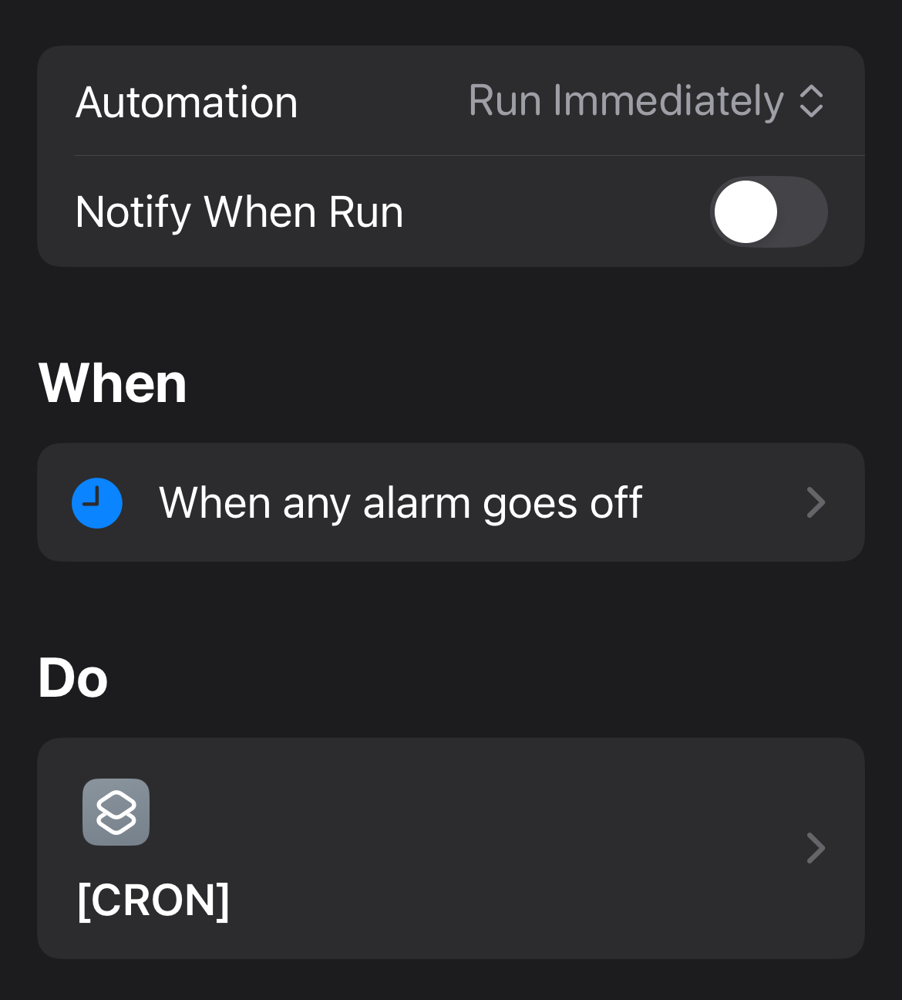

# _shortcut_CRON
## Introduction

CRON is a shortcut that uses iOS Alarms as a job scheduler (like the Linux command `cron`). It can run shortcuts at a date/time in the future, run them repeatedly (x times, or until {date}), use runtime parameters and predefined definitions. 

## Functional Overview
CRON jobs are created using the shortcut `CRON_Submit_Request` with a JSON structure.

An alarm is created with this structure:
`DD/MM/YY`_CRON_`NNN`_`Label1`_`Label2`...
where:
`DD/MM/YY` = date alarm will run
`NNN` = Request_ID
`LabelX` = helpful labels 

### Request Structure
Either Program_ID (Shortcut Name and parameter defaults stored in Data Jar)
or Shortcut_Name (parameters in the Input) 

```
{
"Request_Parameters":
  {
    "Program_ID":"XXX" […XOR…]
    "Shortcut_Name":”Xxxxx",
    "Date_Time": "{Date}" […XOR…]
    "Delay":"NN hrs NN mins",
    "Announce":[Bool, optional]
  },
"Program_Parameters":
  {
    "Param1":"Value",
    …
  }
"Resubmission": [optional]
    { 
        "Delay":"NN hrs NN mins",
        "Until": "{Date}" […OR…]
        "Repeats":  NN
    }
}
```

### Note on resubmission:
- If resubmission not included, it runs once.
- If resubmission has Delay and “Repeats”:N, it repeats N times.
- If resubmission has Delay, but Repeats is omitted, it runs perpetually (until the alarm is deleted, manually or by another process).
- If “until” date/time given and would be exceeded then don’t resubmit. 

## Installation
### Components
- CRON `shortcut`
- [CRON_Process_Alarms] `shortcut`
- [CRON_OnFail] `shortcut`
- CRON_Submit_Request `shortcut`
- `automation` When any alarm goes off, run [CRON] immediately, don't notify

### Prerequisites
- Data Jar `iOS App`

### Instructions
#### Install shortcuts

#### Create automation

